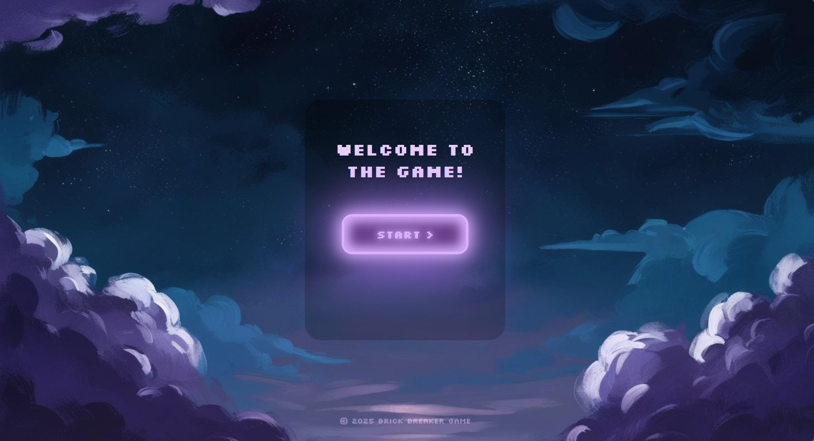
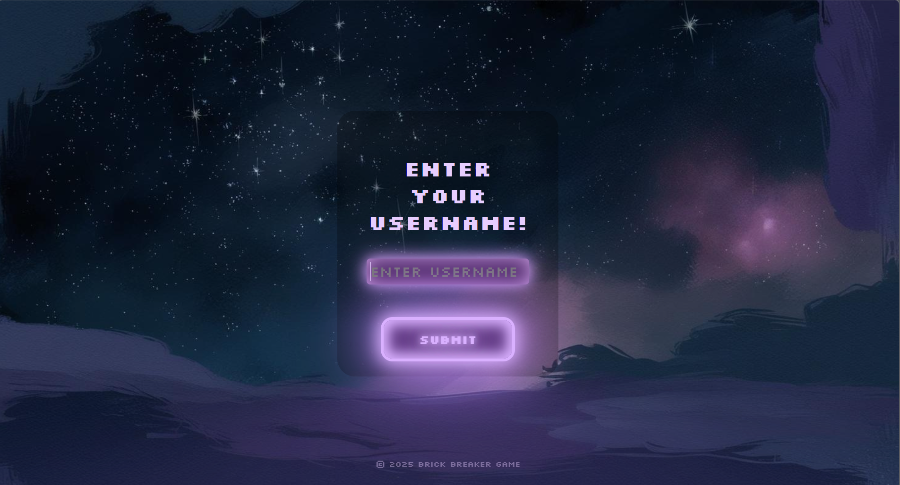
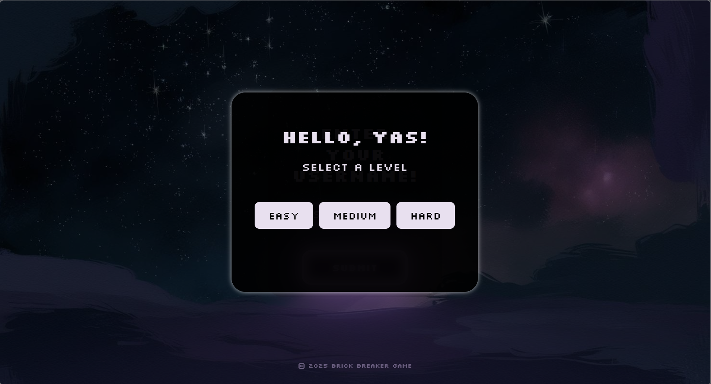
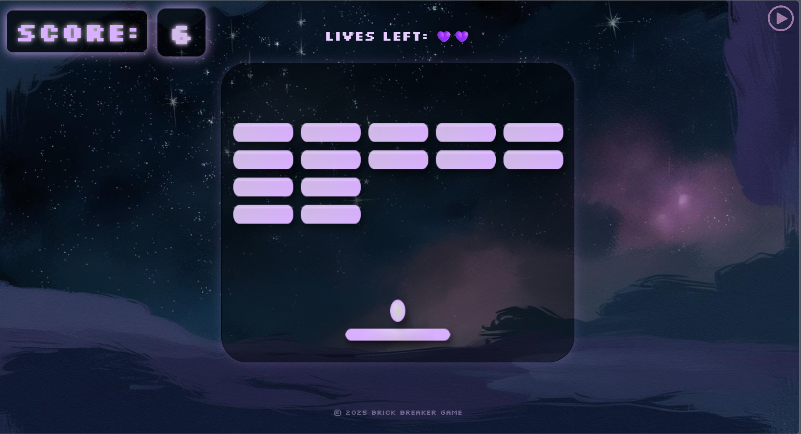
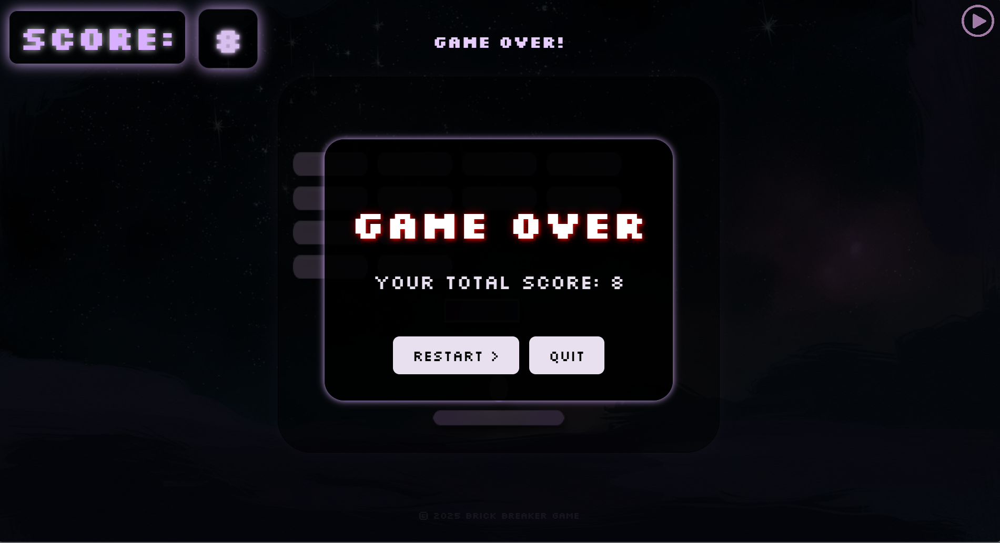
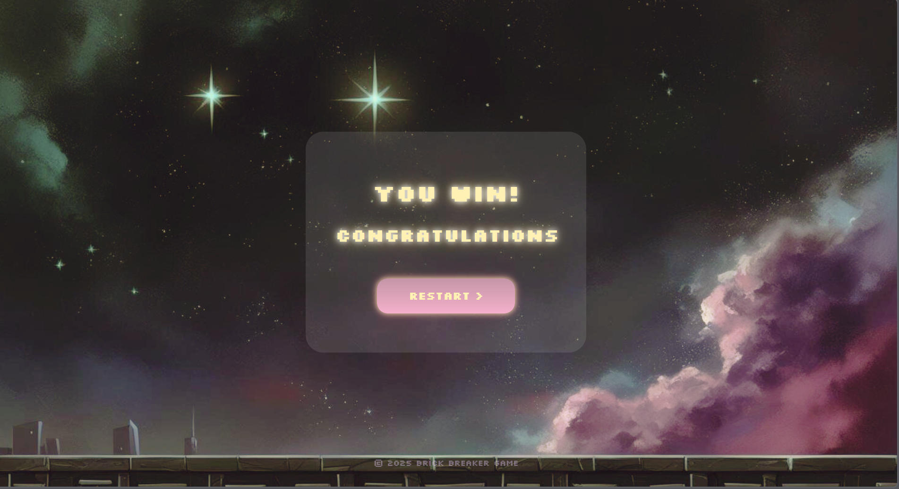

Live Demo: https://yasmine212.github.io/brick-breaker-game/
# Brick Breaker Game 

- **Type:** Web game  
- **Technologies:** HTML, CSS, JavaScript  
- **Objective:** Build a playable brick breaker game demonstrating DOM manipulation, event handling, and game logic.  
- **Collaboration:** Developed with a teammate as part of coursework.

---

## Features

- Interactive paddle and ball movement
- Multiple bricks with collision detection
- Score tracking and level progression
- Sound effects and visual animations
- Responsive layout for different screen sizes

---

## Screenshots

